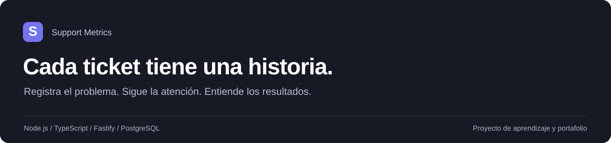
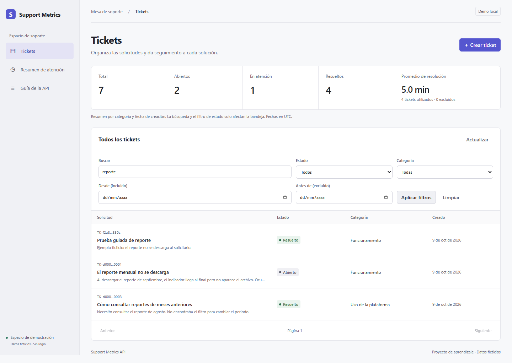
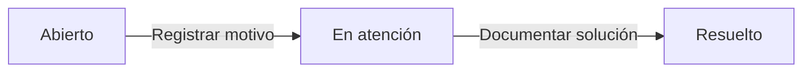
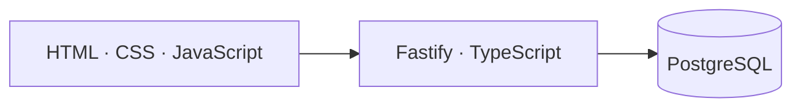

<p align="center">
  
</p>

<p align="center">
  <a href="https://github.com/WENDOSKI07/support-metrics-api/actions/workflows/ci.yml"></a>
</p>

<p align="center">
  <a href="#qué-puedes-hacer">Funcionalidades</a> ·
  <a href="#inicio-rápido">Inicio rápido</a> ·
  <a href="docs/DEVELOPMENT.md">Guía técnica</a> ·
  <a href="#cómo-está-construido">Arquitectura</a>
</p>

# Support Metrics API

Una mesa de soporte para **registrar solicitudes, conservar su conversación y medir su atención**. Backend en TypeScript con PostgreSQL e interfaz web nativa, construidos como proyecto de aprendizaje y portafolio.



<p align="center"><sub>Interfaz del proyecto ejecutada localmente con datos ficticios.</sub></p>

## Qué puedes hacer

| Tickets y seguimiento | Consulta y análisis |
| --- | --- |
| Crear solicitudes con título, descripción y categoría | Buscar por título o descripción |
| Registrar atención y resolución con un motivo | Filtrar por estado, categoría y fechas |
| Consultar el historial de cambios | Recorrer resultados paginados |
| Añadir comentarios, incluso después de resolver | Ver conteos y tiempo promedio de resolución |

### Un flujo claro



Cada cambio conserva su motivo y fecha. El estado y el historial se guardan en una misma transacción; una solicitud con estado desactualizado recibe un conflicto `409`.

**Alcance actual:** demo local sin autenticación ni permisos por usuario. Todas las solicitudes usan `local-demo-user`. `resolved` significa solución registrada, no confirmación del solicitante. No hay borrado, reapertura ni cierre definitivo.

## Inicio rápido

Necesitas **Node.js 20.20.0 o superior**, npm y Docker Desktop con contenedores Linux.

```sh
git clone https://github.com/WENDOSKI07/support-metrics-api.git
cd support-metrics-api
npm ci
```

Copia `.env.example` a `.env` y define una contraseña local en `PGPASSWORD`. Si ya tienes `.env`, consérvalo; Git lo ignora.

```sh
npm run db:up
npm run db:migrate
npm run db:seed
npm run dev
```

| Abrir en el navegador | Qué encontrarás |
| --- | --- |
| [localhost:3000](http://127.0.0.1:3000/) | Dashboard de soporte |
| [localhost:3000/docs](http://127.0.0.1:3000/docs) | Guía de rutas y ejemplos |
| [localhost:3000/health](http://127.0.0.1:3000/health) | Comprobación de respuesta de la API |

La carga de ejemplo añade tres tickets ficticios. Puedes repetirla sin duplicarlos ni sobrescribir tus cambios. PostgreSQL conserva los datos en un volumen de Docker.

<details>
<summary><strong>Probar un recorrido completo desde PowerShell</strong></summary>

Con la API iniciada, ejecuta en otra terminal:

```powershell
./docs/demo.ps1
```

Crea un ticket ficticio, añade un comentario, registra atención y resolución y consulta historial y métricas. El ticket se conserva para revisarlo desde el dashboard.

</details>

## Cómo está construido



| Capa | Tecnología y responsabilidad |
| --- | --- |
| Interfaz | HTML, CSS y JavaScript nativos; diseño responsive y navegación por teclado |
| API | Fastify y TypeScript; validación de entradas y contratos HTTP |
| Persistencia | PostgreSQL, SQL parametrizado, migraciones y transacciones |
| Entorno local | Docker Compose para PostgreSQL |
| Verificación | Node.js Test Runner y GitHub Actions con PostgreSQL temporal |

```text
public/        Dashboard y guía web
src/           Rutas, validaciones y acceso a datos
migrations/    Evolución del esquema PostgreSQL
scripts/       Migraciones y datos de demostración
tests/         Pruebas aisladas
integration/   Pruebas con PostgreSQL
docs/          Guía técnica y ejemplo ejecutable
```

Los comentarios se muestran como texto plano. La interfaz conserva la política de seguridad de contenido y solo recibe los archivos públicos permitidos por el servidor.

## Qué significan las métricas

- **Conteos:** tickets creados en el periodo elegido, agrupados por su estado actual.
- **Resolución:** tiempo entre creación y primera resolución de los tickets actualmente resueltos con duración válida; incluye noches y fines de semana.
- **Muestra:** cantidad de tickets utilizados y cantidad excluida. Sin observaciones, el promedio es `null`.

Los filtros de fechas usan **UTC**. Categoría y fechas afectan el resumen; búsqueda y estado solo filtran la bandeja. Estas cifras no miden satisfacción ni disponibilidad del servicio.

## Comprobaciones

```sh
npm test          # Compilación y pruebas aisladas
npm run test:db   # Integración con PostgreSQL iniciado y migrado
```

Las pruebas cubren validaciones, persistencia, paginación, búsqueda, comentarios, métricas, conflictos de estado y rollback. La prueba de migraciones crea y elimina su propia base temporal; requiere permiso `CREATEDB` en el entorno de pruebas.

[Ver ejecuciones de CI](https://github.com/WENDOSKI07/support-metrics-api/actions/workflows/ci.yml) · [Consultar la guía técnica](docs/DEVELOPMENT.md)

## Próximas etapas

- Identidad y permisos por usuario.
- Vinculación de tickets a incidentes compartidos.
- Análisis de problemas recurrentes y exploración con Power BI.

Estas capacidades están pendientes. El proyecto avanza por etapas con reglas y pruebas antes de ampliar el alcance.

---

Desarrollado por [Oscar Ricaurte · WENDOSKI07](https://github.com/WENDOSKI07).
